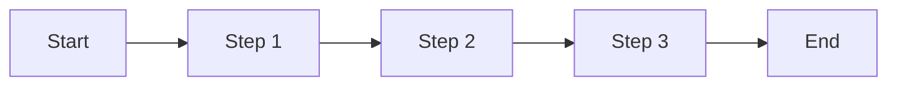

在这一部分，我们将介绍一些Markdown的扩展语法。Markdown的扩展语法包括表格、脚注、数学公式、任务列表和流程图等。这些扩展语法可以帮助用户撰写更加丰富多彩的文章。

### 2.1 表格的创建和格式化

表格是在文档中呈现结构化数据时非常有用的工具。Markdown 提供了创建简单表格的语法，您可以使用竖线（|）和短横线（-）来定义表头和表格的边界，并使用竖线来分隔单元格。例如：

```
| 列1标题 | 列2标题 |
|----------|----------|
| 单元格1 | 单元格2 |
| 单元格3 | 单元格4 |

```

Markdown 还支持对表格进行格式化，例如对表格的列进行对齐、添加背景色等。

### 2.2 脚注和注释的添加

Markdown 使用方括号（[]）和脚注引用符（[^1]）来添加脚注和注释。脚注和注释的内容放在文章的末尾，并使用数字或符号作为引用标记。例如：

```
这是一个带有脚注的段落。[^1]

[^1]: 这是一个脚注的内容。

```

### 2.3 数学公式的插入和排版

如果您需要在文档中插入数学公式，Markdown 提供了一些方式来实现。您可以使用 LaTeX 语法或 MathJax 插件来插入和排版数学公式，以便更好地呈现数学表达式。例如：

行内公式：

E=mc
​2


块级公式：


```
$$
E=mc^2
$$

```

Markdown 通常使用美元符号（$）和反引号（`）来插入数学公式。数学公式的内容放在美元符号和反引号之间。例如：

```xml
$x^2 + y^2 = z^2$

```

Markdown 还支持对数学公式进行排版，例如对公式进行居中、添加背景色等。

### 2.4 任务列表的使用

任务列表是在文档中跟踪任务、待办事项或清单的好方法。Markdown 使用方括号（[]）和短横线（-）来创建任务列表。任务列表中的每个项目都由一个方括号和一个短横线组成。已完成的任务可以使用一个叉号（x）来标记。例如：

```
- [x] 完成任务1
- [ ] 完成任务2
- [ ] 完成任务3

```

### 2.5 绘制流程图和时序图

有时候，您可能需要在文档中绘制流程图或时序图来展示过程或顺序。Markdown 可以使用 Mermaid 或 PlantUML 等工具来绘制流程图和时序图。Mermaid.js 库是一个开源的 JavaScript 库，可以将文本转换为流程图和时序图。例如，以下代码可以绘制一个简单的流程图和时序图：

流程图示例



时序图示例

```
sequenceDiagram
    participant A
    participant B
    A->>B: 消息1
    B->>A: 消息2

```

掌握了这些扩展语法，你就可以轻松地创建表格、添加脚注和注释、插入和排版数学公式、创建任务列表以及绘制流程图和时序图。